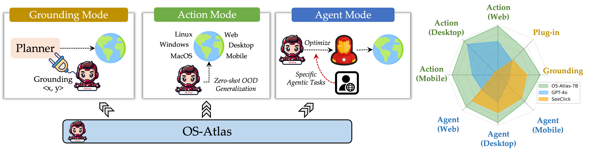

# About Me

Here is **Ningyuan Xi (奚宁远)**. 

I am currently an undergraduate student in the School of Computer Science and Engineering at the Beihang University. 

If you are interested in any aspect of me, I am always open to discussions and collaborations. Feel free to reach out to me at - xiningyuan [at] buaa.edu.cn

---

## Research Interests

**I am actively seeking a PhD position for 2025 Fall admission. If you have any information, please contact me!**

- Large Language Model
- Nature Language Processing
- Applied Machine Learning

My current research focuses on how to train a smarter LLM . My interests a

---

Preprint

[OS-ATLAS: A Foundation Action Model for Generalist GUI Agents 🔥🔥](https://arxiv.org/abs/2410.23218) [Preprint] \\
Zhiyong Wu\*, Zhenyu Wu\*, **Fangzhi Xu**\*, Yian Wang\*, Qiushi Sun, Chengyou Jia, Kanzhi Cheng, Zichen Ding, Liheng Chen, Paul Pu Liang, Yu Qiao

(\* means equal contributions)

[**Code**](https://github.com/OS-Copilot/OS-Atlas) &nbsp;
[**Project Page**](https://osatlas.github.io) &nbsp;
[**Demo**](https://huggingface.co/spaces/maxiw/OS-ATLAS) &nbsp;

Preprint

[Interative Evolution: A Neural-symbolic Self-Training Framework for Large Language Models 🔥🔥](http://arxiv.org/abs/2406.11736) [Preprint] \\
**Fangzhi Xu**, Qiushi Sun, Kanzhi Cheng, Jun Liu, Yu Qiao, Zhiyong Wu.

[**Code**](https://github.com/xufangzhi/ENVISIONS) &nbsp;
[**Project Page**](https://github.com/xufangzhi/ENVISIONS) &nbsp;
 &nbsp;

ACL 2024

[Symbol-LLM: Towards Foundational Symbol-centric Interface
For Large Language Models](https://arxiv.org/pdf/2311.09278) [CCF-A] \\
**Fangzhi Xu**, Zhiyong Wu, Qiushi Sun, Siyu Ren, Fei Yuan, Shuai Yuan, Qika Lin, Qiao Yu and Jun Liu.

[**Code**](https://github.com/xufangzhi/Symbol-LLM) &nbsp;
[**Project Page**](https://xufangzhi.github.io/symbol-llm-page/) &nbsp;
 &nbsp;

ACL 2024

[PathReasoner: Modeling Reasoning Path with Equivalent Extension for Logical Question Answering](https://xufangzhi.github.io/) [CCF-A] \\
**Fangzhi Xu**, Qika Lin, Tianzhe Zhao, Jiawei Han, Jun Liu 

[**Code**](https://github.com/xufangzhi/)
  

Preprint

[Are Large Language Models Really Good Logical Reasoners? A Comprehensive Evaluation and Beyond](https://arxiv.org/abs/2306.09841) Under Review at IEEE TKDE [CCF-A] \\
**Fangzhi Xu**\*, Qika Lin\*, Jiawei Han, Tianzhe Zhao, Jun Liu and Erik Cambria

(\* means equal contributions)

[**Code**](https://github.com/xufangzhi/)

  

SIGIR 2022

[Logiformer: A Two-Branch Graph Transformer Network for Interpretable Logical Reasoning](https://arxiv.org/abs/2205.00731) [CCF-A] \\
**Fangzhi Xu**, Jun Liu, Qika Lin, Yudai Pan and Lingling Zhang

[**Code**](https://github.com/xufangzhi/Logiformer/)
  

[//]: # (## News and Updates)

[//]: # ()
[//]: # (- **June 2024**：Very excited to be selected as [KDD UC Scholar]&#40;https://kdd2024.kdd.org/undergraduate-consortium/&#41;. See you in Spain!)

[//]: # (- **May 2024：**My bachelor thesis won the Annual Best Thesis Award &#40;Top 1/300&#41;.)

[//]: # (- **April 2024：**Our work *BLEGuard* has been accepted to [MobiSys 2024]&#40;https://www.sigmobile.org/mobisys/2024/&#41; as a poster paper. See you in Japan!)

[//]: # (- **March 2024：**Very excited to get a MPhil offer from Engineering department at Cambridge University!)

[//]: # (- **Dec 2023：**Very excited to be selected as [AAAI UC Scholar]&#40;https://aaai.org/aaai-conference/undergraduate-consortium-program/&#41;. See you in Canada!)

[//]: # (- **Jun 2022：**Started research programme at [Cambridge AI Group]&#40;https://www.cl.cam.ac.uk/research/ai/&#41;, advised by Prof. Pietro Liò.)

 

[//]: # (<blockquote class="twitter-tweet">
Thrilled to be an AAAI-UC Scholar at <a href="https://twitter.com/hashtag/AAAI24?src=hash&amp;ref_src=twsrc%5Etfw">#AAAI24</a>, thanks to <a href="https://twitter.com/hashtag/AAAI?src=hash&amp;ref_src=twsrc%5Etfw">#AAAI</a> &amp; <a href="https://twitter.com/hashtag/GoogleExploreCSR?src=hash&amp;ref_src=twsrc%5Etfw">#GoogleExploreCSR</a> for the sponsorship. Grateful for the knowledge gained and new friendships formed.  Wonderful trip in Vancouver. Looking forward to staying connected with all.<a href="https://twitter.com/hashtag/AAAI24?src=hash&amp;ref_src=twsrc%5Etfw">#AAAI24</a> <a href="https://twitter.com/hashtag/Vancouver?src=hash&amp;ref_src=twsrc%5Etfw">#Vancouver</a> <a href="https://twitter.com/hashtag/GoogleExploreCSR?src=hash&amp;ref_src=twsrc%5Etfw">#GoogleExploreCSR</a> <a href="https://t.co/wUQUp8XlSM">pic.twitter.com/wUQUp8XlSM</a>
&mdash; Hanlin CAI &#40;seeking a PhD position 2025&#41; &#40;@lancecai2002&#41; <a href="https://twitter.com/lancecai2002/status/1762210025173344260?ref_src=twsrc%5Etfw">February 26, 2024</a></blockquote> )

